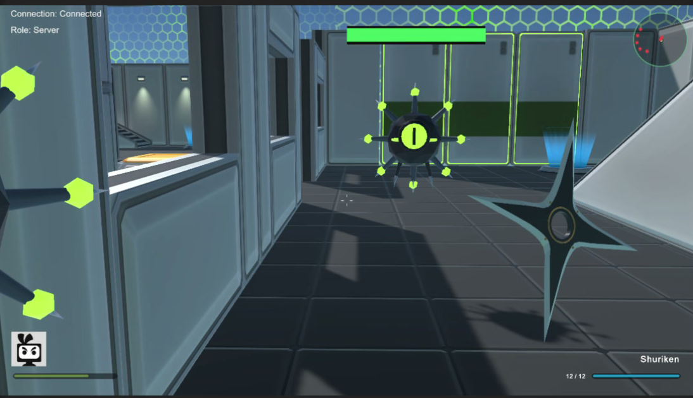

# vxrl-fps — AI tooling sample project

▶️ **[Watch the demo on YouTube](https://www.youtube.com/watch?v=YsSH1jBLmko)**

A **sample / experiment project**, not a finished game. It exists to test how far modern AI tooling can take a game-dev task end to end.

It starts from Unity's **Multiplayer FPS template** (Unity 6, Netcode for Entities) and converts it into a small **PvE** game: play as a **Ninja** or **Shogun** and clear a facility of computer-**virus** enemies with themed weapons (shuriken + short blade, spear-launcher + katana).

## What was tested

- **[Claude Code](https://claude.com/claude-code)** — gameplay/systems code, editor tooling, UI, debugging, and wiring everything together.
- **[Codex](https://openai.com/codex/)** — a parallel coding assistant (e.g. the first-person weapon-pose / arm-IK work).
- **[Blender](https://www.blender.org/)** — 3D assets. The weapon and enemy models were generated with **Codex (Astra)** driving Blender scripting, then imported into Unity.

## What's in it

- Ninja / Shogun characters with weapon loadouts and 1/2 weapon swap (ranged + melee)
- Virus enemies (5 types incl. 2 bosses) with chase/attack AI, hit feedback, and health bars
- First-person weapon viewmodels, HUD (portrait, ammo, weapon name), minimap, and a victory screen
- A re-themed menu with clickable character cards, plus Single / Multiplayer entry
- Editor tools under **Tools ▸ PvE** to build and register enemies, viewmodels, and placeholder weapons

## vxrl-fps2 — ROOTBREACH

[`vxrl-fps2/`](vxrl-fps2/) is a separate single-player follow-up: one authored level, Ninja/Shogun loadouts, keys, secrets and a boss, built with URP and exported to WebGL with mobile touch controls.

▶️ **[Play it in the browser at fps.vxrl.ai](https://fps.vxrl.ai)** — see [vxrl-fps2/README.md](vxrl-fps2/README.md) for controls, build and hosting.

## Status

Work in progress — the core loop (move, swap weapons, fight enemies, win) plays, with campaign/lives systems still to come. Built and tested in the Unity Editor (`6000.6.4f1`).
