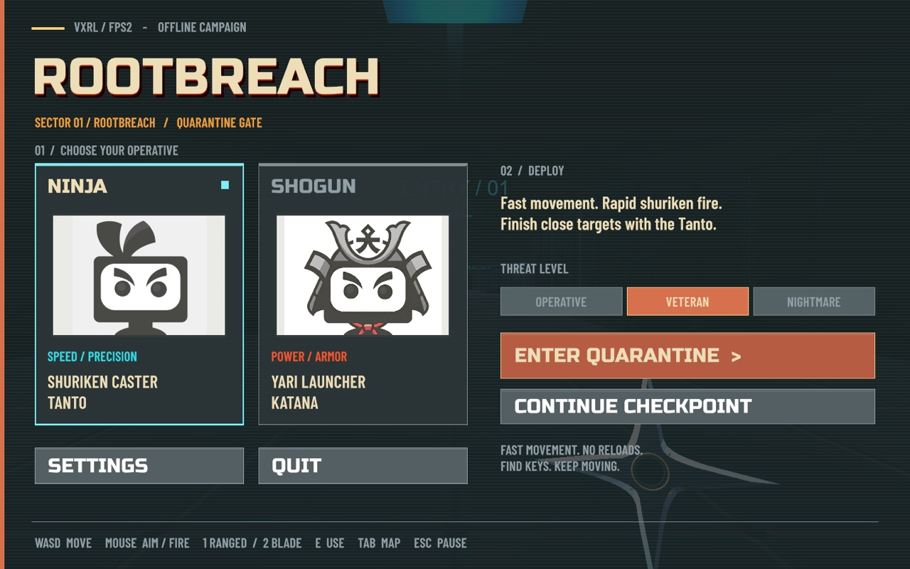
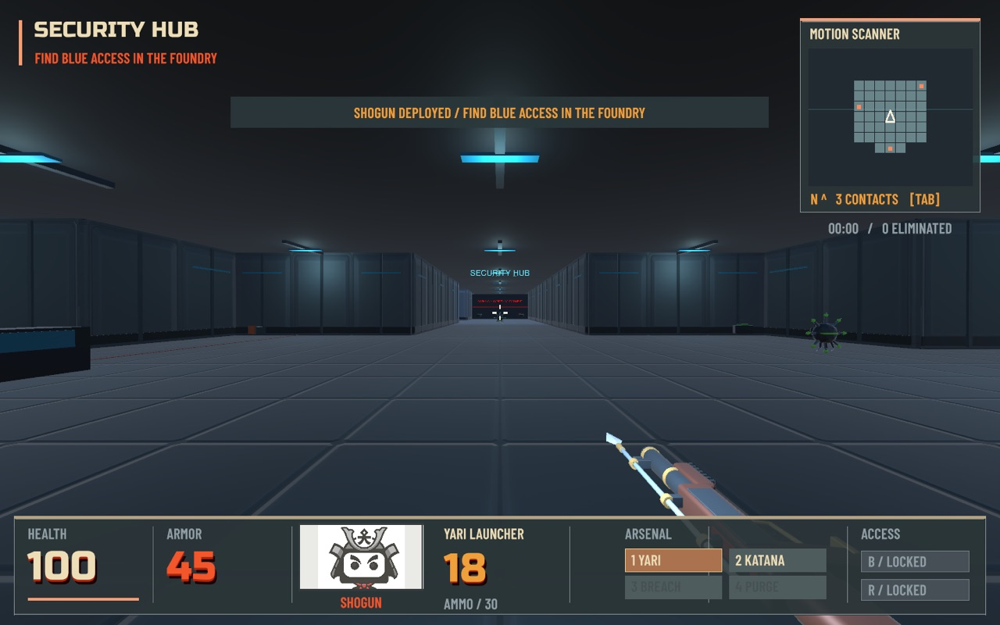
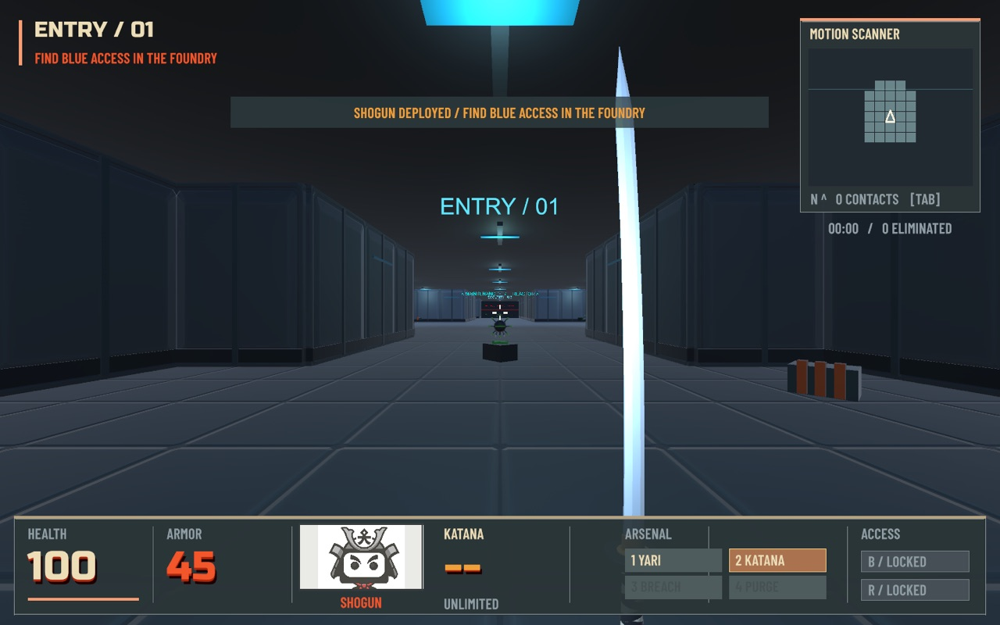
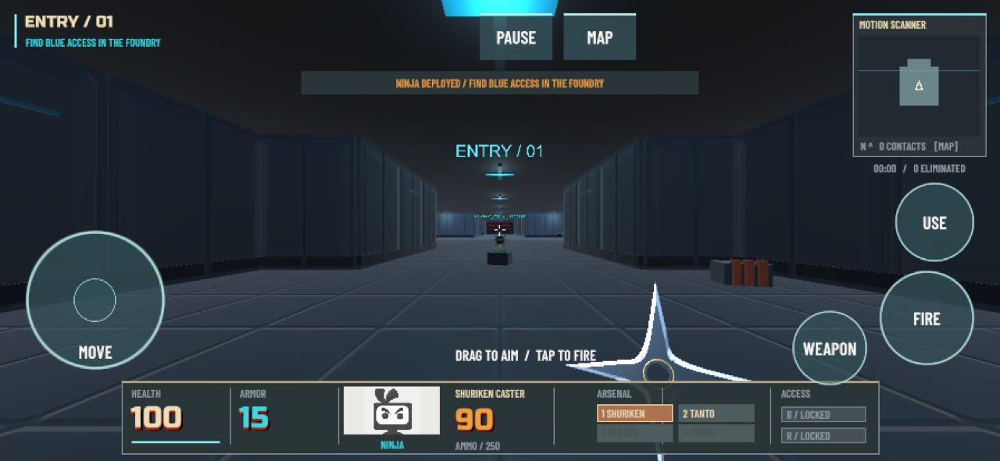
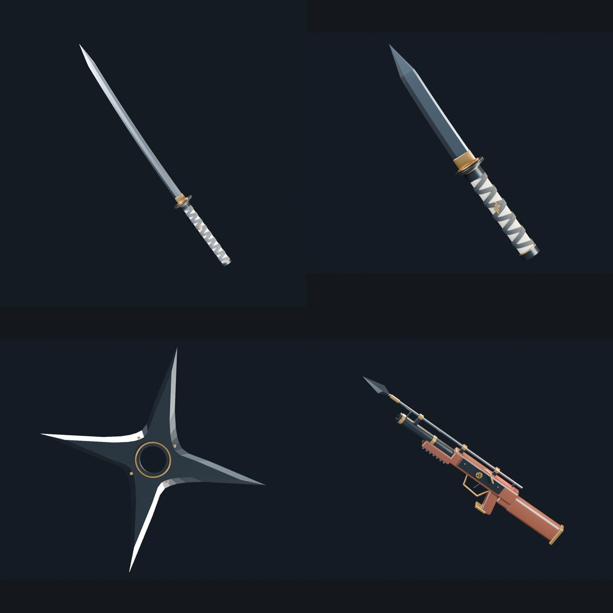
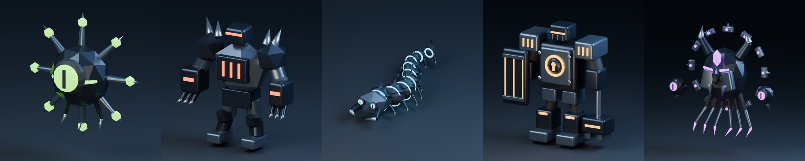

# VXRL FPS — AI tooling sample projects

▶️ **[Play ROOTBREACH in your browser at fps.vxrl.ai](https://fps.vxrl.ai)** — desktop keyboard/mouse, or a phone in landscape with touch controls.

**Sample / experiment projects**, not finished games. They exist to test how far modern AI tooling can take a game-dev task end to end.

## ROOTBREACH (`vxrl-fps2/`) — the main demo

A single-player Unity 6 (URP) FPS: play as a **Ninja** or **Shogun** and purge a quarantined facility of computer-**virus** enemies. Find the keys, uncover hidden caches, and destroy the Warden boss to reach the purge terminal.

| | |
|---|---|
|  |  |
| Shogun with the Yari launcher, HUD and motion scanner | Close-range katana strike |

*Mobile browser: movement pad on the left, drag to aim, round FIRE / WEAPON / USE buttons.*

- **Two loadouts:** Ninja (fast; shuriken caster + tanto, 15 armor) and Shogun (heavy; yari launcher + katana, 45 armor), plus shared shotgun/rifle pickups.
- **One authored level:** 29 enemies, blue and red key gates, three hidden caches, and a Warden boss.
- **Interface:** HUD, motion-scanner minimap, full sector map, three difficulty levels, settings, and checkpoint save/continue.
- **Runs everywhere:** a macOS build and a WebGL build with mobile touch controls and sound that starts on the first tap.
- **Data-driven content:** levels, enemies and weapons are ScriptableObjects; editor tooling validates the campaign before building.
- **Validated:** an automated smoke suite (83 checks, including multitouch input) runs on the macOS build. Physical-phone testing is still open.

See [vxrl-fps2/README.md](vxrl-fps2/README.md) for controls, building, and hosting, and [vxrl-fps2/EXTENDING.md](vxrl-fps2/EXTENDING.md) to add levels, enemies and weapons.

## vxrl-fps — the original PvE conversion

The first experiment converted Unity's Multiplayer FPS template into a small PvE game. See **[vxrl-fps.md](vxrl-fps.md)** and the [YouTube demo](https://www.youtube.com/watch?v=YsSH1jBLmko).

## Who did what

Two AI coding agents and Blender, with a person steering, reviewing, and play-testing.

### Codex (GPT-6 Astra)

- **Blender models.** Codex wrote Blender Python scripts, ran Blender headless, and exported FBX files plus preview renders: a katana, tantō, shuriken and a matchlock-style yari spear launcher, and five enemies (Virus Scout, Malware Brawler, Worm Burrower, and the Ransomware Warden and Rootkit Overlord bosses).

  
  

- **ROOTBREACH (Unity).** Codex designed and built vxrl-fps2 as a separate Unity project: the [design doc](vxrl-fps2/DESIGN.md), data-driven levels/enemies/weapons, NavMesh enemies, keyed gates and secrets, the Doom-style HUD and motion-scanner minimap, Ninja/Shogun classes, checkpoints, and the automated smoke tests and route playtest.
- **Sound effects.** Codex replaced the gun sound on the shuriken and the metal clank on the blades with original swish and chop sounds, generated by a small Python script ([`Tools/generate_blade_audio.py`](vxrl-fps2/Tools/generate_blade_audio.py)) instead of recordings. It also timed melee damage to the visible slash. Other sounds come from Unity's FPS Sample clips.
- **Mobile controls.** Codex added the virtual movement pad, drag-to-aim, fire/weapon/use buttons and multitouch tests, made the pad circular, and helped work around a Safari crash with versioned build file names.
- **vxrl-fps fixes.** Codex fixed the weapon-swap bug that disabled the Shogun's camera and worked on weapon hand poses.

### Claude Code

- **vxrl-fps PvE conversion.** Claude Code did the gameplay conversion of the multiplayer template (see [vxrl-fps.md](vxrl-fps.md)).
- **Shipping ROOTBREACH to the web.** Claude Code set up the WebGL build, deployed it to an EC2 server behind nginx at [fps.vxrl.ai](https://fps.vxrl.ai), fixed silent audio on phones, picked up an unfinished Codex task (finish testing the round touch controls, rebuild, re-deploy), and set up the repo's `.gitignore` and READMEs.

### Blender and Unity

- [Blender](https://www.blender.org/) 5.2, driven by scripts rather than by hand.
- Unity `6000.6.4f1` for both projects (URP for ROOTBREACH).

The full story is in the blog post: [docs/blog.md](docs/blog.md).
